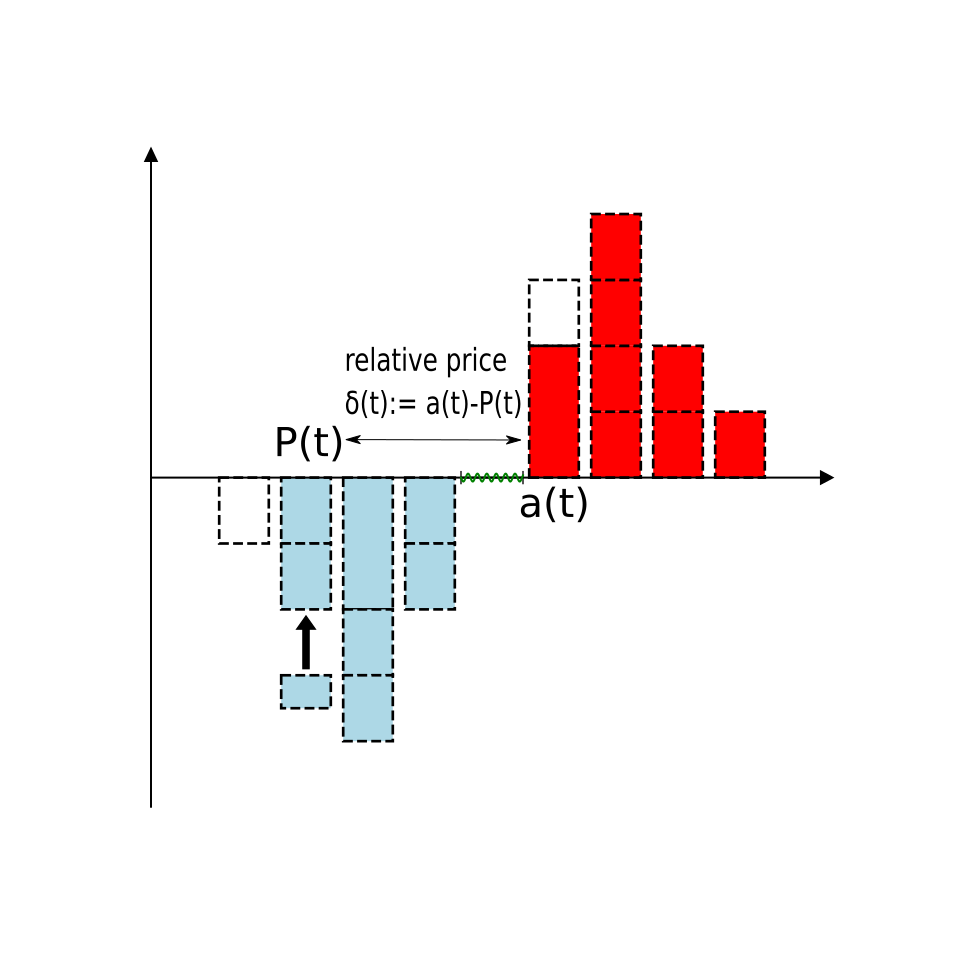

# The relative price: 相対価格

相対価格$\delta(t)$とは、指値注文などの注文価格の評価方法である。この方法では:

- その注文が買い注文ならば、最良売り価格 $a(t)$ とその注文価格 $p(t)$ の差 $\delta(t)=a(t)-p(t)$ と定義される。
- 一方、売り注文ならば、最良買い価格 $b(t)$ とその注文価格 $p(t)$ の差 $\delta(t)=p(t)-b(t)$ と定義される。

イメージ図:
